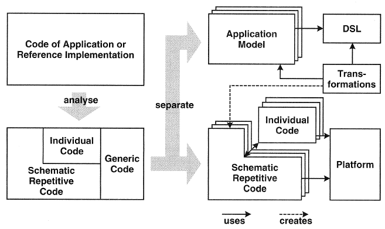

# Model-Driven Development

## Introduction
A significant factor behind the difficulty of developing complex software 
is the wide conceptual gap between the problem and the implementation 
domains – **problem-implementation gap**.

Bridging the gap using approaches that require **extensive handcrafting of
implementation** gives rise to accidental complexities that make the development 
of software difficult and costly.

The growing complexity of software is the motivation behind work on 
**industrializing software development**.

The application of models to software development is a long-standing tradition, 
and has become even more popular since the development of the **Unified Modeling
Language (UML)**.
We use UML mainly as **documentation**, where the relationship between model 
and software implementation is only intentional but not formal. 
We call this flavor of model usage **model-based approach**.

_Example:_ JavaBean implementation vs. UML diagrams (class- and object diagram)

**Model-Driven Development (MDD)** is the natural continuation of programming 
as we know it today and has an entirely different approach: 

> **Models** do not constitute documentation, but are considered **equal to code**, 
> as their implementation is automated.

This process creates a great potential for **automation of software production**,
which in turn leads to increased productivity.

Models can also be understood by **domain experts**. 
**Graphical models** are often used, but **textual models** are an equally 
feasible option.

The process of analyzing a problem, conceiving a solution, and expressing 
a solution in a high-level programming language can be viewed as an 
**implicit form of modeling**.

> Software developing is essentially a model-based problem-solving activity!

Writing source code is a modeling activity because the developer is modeling 
a solution using the abstractions provided by a programming language.

## MDD Goals

The general goals of Model Driven Development are to increase efficiency 
and improve code quality. 

* **Increased development speed**: Runnable code can be generated from 
    formal models using one or more transformation steps - **automation**.

* **Enhanced software quality**: The use of **automated transformations** 
    and **formally-defined modeling languages** lets you enhance software 
    quality. A software architecture will recur uniformly in an 
    implementation.

* **Better maintainability**: Implementation aspects can be **changed in 
    one place**, for example in the **transformation rules**. The same is 
    true for fixing bugs in generated code.

* **Manageability of complexity through abstraction**: The modeling languages 
    enable programming or configuration on a more abstract level. 
    For this purpose, the models must ideally be described using a 
    **problem-oriented modeling language**.

* **Software product lines**: Architectures, modeling languages and 
    transformations can be used to establish software product lines which 
    lead to a **higher level of reusability**.

## MDD Approach

We can refactor the code of an existing application so that three parts 
can be separated:
* **Generic code**: The generic part is identical for all future applications.
* **Schematic repetitive code**: The schematic part is not identical for 
    all applications but possesses the same systematics.
* **Individual code**: The application specific part cannot be generalized.

_Figure: MDD Approach (Stahl & Völter, 2006)_

## MDD Challenges

The major challenges when realizing the MDD vision can be grouped into the following categories:

* **Modeling language challenges** arise from concerns associated with 
    providing support for creating and using problem-level abstractions 
    in modeling languages, and for rigorously analyzing models.

* **Separation of concerns** challenges arise from problems associated 
    with modeling systems using multiple, overlapping viewpoints that 
    utilize possibly heterogeneous languages.
    
* **Model manipulation and management challenges** arise from problems 
    associated with:
    * defining, analyzing, and using model transformations  
    * maintaining traceability links among model elements to support 
        model evolution and roundtrip engineering
    * maintain consistency among viewpoints
    * tracking versions
    
## References

* Thomas Stahl, Markus Völter. **Model-Driven Software Development**. Wiley 2006
* Bran Selic. **The Pragmatics of Model-Driven Development**. IEEE Software, 2003
* Robert France, Bernhard Rumpe. **Model-driven Development of Complex Software: A Research Roadmap**. Future of Software Engineering, FOSE 2007

*Egon Teiniker, 2017-2024, GPL v3.0*